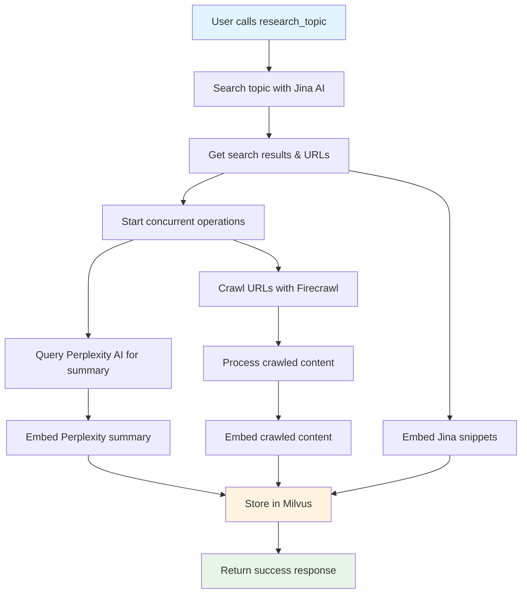

# MCP Ragster

A Model Context Protocol (MCP) server that provides intelligent topic research and retrieval capabilities.
Combines multiple AI services to gather, process, and search contextual information about any topic.

## What It Does

- **Research topics comprehensively**: Automatically gathers information from web search, AI summaries, and full content crawling
- **Store and index content**: Creates a searchable knowledge base using vector embeddings
- **Semantic search**: Find relevant information using natural language queries

## Features

- **`research_topic` tool**: Researches a topic by gathering information from Jina (web search), Perplexity (AI summaries), and Firecrawl (full content)
- **`query_topic` tool**: Search the gathered information using semantic similarity
- **Automatic content processing**: Handles embedding and storage of all gathered content
- **Robust error handling**: Gracefully handles API failures and network issues

## How It Works

1. **Topic Loading**: Use `research_topic` with any topic to research and index information
2. **Information Gathering**: Automatically searches the web, generates summaries, and crawls relevant content
3. **Content Storage**: Embeds all content using Voyage AI and stores in Milvus vector database
4. **Querying**: Use `query_topic` to search the indexed content with natural language queries

### Load Topic Process Flow



## Prerequisites

- **Python 3.13+**
- **uv package manager** (`pip install uv`)
- **Running Milvus instance** (local or cloud)
- **Required API Keys**:
  - `VOYAGEAI_API_KEY` - for embeddings
  - `PERPLEXITY_API_KEY` - for AI summaries  
  - `JINA_API_KEY` - for web search
  - `FIRECRAWL_API_KEY` or `FIRECRAWL_API_URL` - for web crawling

## Installation

```bash
# Setup environment
uv sync

# Configure API keys
cp .env.example .env
# Edit .env with your API keys
```

## Usage

**Start the server:**

```bash
mcp dev src/ragster/main.py
```

**Or run directly:**

```bash
uv run src/ragster/main.py
# or
uv run start-mcp-server
```

## MCP Tools

### `research_topic`

Researches and indexes information about a topic.

**Input:**

```json
{
    "topic": "Quantum Computing Error Correction"
}
```

**What it does:**

- Searches the web using Jina AI to find relevant URLs and snippets
- Gets an AI-generated summary from Perplexity AI
- Crawls the found URLs using Firecrawl to get full content
- Embeds all content using Voyage AI and stores in Milvus

**Output:**

```json
{
    "message": "Topic 'Quantum Computing Error Correction' processing initiated. All operations initiated successfully.",
    "topic": "Quantum Computing Error Correction",
    "urls_processed": 3,
    "perplexity_queried": true,
    "jina_results_found": 5,
    "errors": []
}
```

### `query_topic`

Search the indexed information using natural language.

**Input:**

```json
{
    "query": "What are the main challenges in quantum error correction?",
    "top_k": 5
}
```

**What it does:**

- Embeds your query using Voyage AI
- Searches the Milvus vector database for semantically similar content
- Returns the most relevant text fragments with source information

**Output:**

```json
{
    "query": "What are the main challenges in quantum error correction?",
    "results": [
        {
            "id": "450123...",
            "text_content": "Decoherence remains a major hurdle in quantum error correction...",
            "source_type": "firecrawl",
            "source_identifier": "https://example.com/quantum-challenges",
            "topic": "Quantum Computing Error Correction",
            "distance": 0.23
        }
    ],
    "message": "Found 5 relevant documents."
}
```

## Example Workflow

1. **Research a topic:**

   ```json
   {
       "tool": "research_topic",
       "arguments": {
           "topic": "Latest developments in renewable energy storage"
       }
   }
   ```

2. **Query the information:**

   ```json
   {
       "tool": "query_topic", 
       "arguments": {
           "query": "What are the most promising battery technologies?",
           "top_k": 3
       }
   }
   ```

3. **Get relevant results** with source attribution and semantic similarity scores.

## Notes

- All API keys are required for the server to function
- The server will automatically handle embedding dimension matching for known Voyage AI models
- Content is stored persistently in Milvus, so you can query topics multiple times without reloading
- Failed API calls are handled gracefully with appropriate error messages

## Testing

Run the test suite using `uv` and `pytest`:

```bash
uv run pytest
```

## Documentation

- https://docs.jina.ai/
- https://docs.perplexity.ai/home
- https://milvus.io/api-reference/pymilvus/v2.5.x/About.md