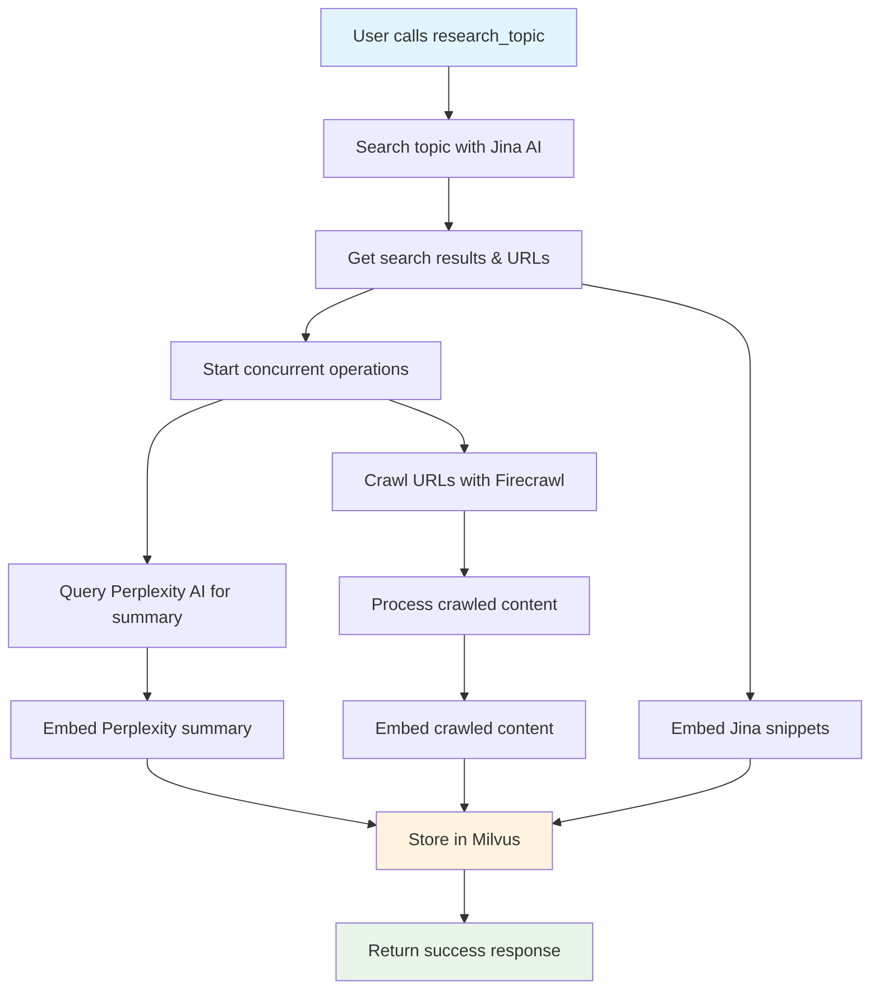

# MCP Ragster

A Model Context Protocol (MCP) server that provides intelligent topic research and retrieval capabilities.
Combines multiple AI services to gather, process, and search contextual information about any topic.

## What It Does

- **Research topics comprehensively**: Automatically gathers information from web search, AI summaries, and full content crawling
- **Store and index content**: Creates a searchable knowledge base using vector embeddings
- **Semantic search**: Find relevant information using natural language queries

## Features

- **`research_topic` tool**: Researches a topic by gathering information from Jina (web search), Perplexity (AI summaries), and Firecrawl (full content)
- **`query_topic` tool**: Search the gathered information using semantic similarity
- **Automatic content processing**: Handles embedding and storage of all gathered content
- **Robust error handling**: Gracefully handles API failures and network issues

## How It Works

1. **Topic Loading**: Use `research_topic` with any topic to research and index information
2. **Information Gathering**: Automatically searches the web, generates summaries, and crawls relevant content
3. **Content Storage**: Embeds all content using Voyage AI and stores in Milvus vector database
4. **Querying**: Use `query_topic` to search the indexed content with natural language queries

### Load Topic Process Flow



## Prerequisites

- **Python 3.13+**
- **uv package manager** (`pip install uv`)
- **Running Milvus instance** (local or cloud)
- **Required API Keys**:
  - `VOYAGEAI_API_KEY` - for embeddings
  - `PERPLEXITY_API_KEY` - for AI summaries  
  - `JINA_API_KEY` - for web search
  - `FIRECRAWL_API_KEY` or `FIRECRAWL_API_URL` - for web crawling

## Installation

```bash
# Setup environment
uv sync

# Configure API keys
cp .env.example .env
# Edit .env with your API keys
```

## Usage

**Start the server:**

```bash
mcp dev src/ragster/main.py
```

**Or run directly:**

```bash
uv run src/ragster/main.py
# or
uv run start-mcp-server
```

## MCP Tools

### `research_topic`

Researches and indexes information about one or more topics **asynchronously**. Returns immediately with a job ID for tracking progress.

**Input:**

```json
{
    "topics": ["Quantum Computing Error Correction", "AI in Healthcare"]
}
```

- Supports 1-10 topics per job
- Returns a job ID and estimated completion time
- Use job management tools below to monitor and control jobs

**Output:**

```json
{
    "job_id": "b1c2d3e4-...",
    "status": "pending",
    "topics": ["Quantum Computing Error Correction", "AI in Healthcare"],
    "message": "Research job created for 2 topics (0 cached, 2 to process). Use get_research_status to monitor progress.",
    "created_at": "2024-06-10T12:34:56Z",
    "estimated_completion_time": "2024-06-10T12:35:56Z"
}
```

### `get_research_status`

Get the status and progress of a research job.

**Input:**

```json
{
    "job_id": "b1c2d3e4-..."
}
```

**Output:**

```json
{
    "job_id": "b1c2d3e4-...",
    "status": "running",
    "topics": ["Quantum Computing Error Correction", "AI in Healthcare"],
    "overall_progress": 0.67,
    "topic_progress": {
        "Quantum Computing Error Correction": {
            "jina_status": "completed",
            "perplexity_status": "completed",
            "firecrawl_status": "running",
            "urls_found": 5,
            "urls_processed": 3,
            "completion_percentage": 0.67,
            "errors": []
        },
        "AI in Healthcare": {
            "jina_status": "completed",
            "perplexity_status": "running",
            "firecrawl_status": "pending",
            "urls_found": 4,
            "urls_processed": 0,
            "completion_percentage": 0.33,
            "errors": []
        }
    },
    "estimated_completion_time": "2024-06-10T12:36:30Z",
    "results": null,
    "error": null
}
```

### `list_research_jobs`

List all research jobs, with optional status filtering and pagination.

**Input:**

```json
{
    "status_filter": "running",
    "limit": 5,
    "offset": 0
}
```

**Output:**

```json
{
    "jobs": [
        {
            "job_id": "b1c2d3e4-...",
            "status": "running",
            "topics": ["Quantum Computing Error Correction", "AI in Healthcare"],
            "overall_progress": 0.67,
            "topic_progress": { ... },
            "estimated_completion_time": "2024-06-10T12:36:30Z",
            "results": null,
            "error": null
        }
    ],
    "total_count": 1,
    "has_more": false
}
```

### `cancel_research_job`

Cancel a running research job. Any completed topic results are preserved.

**Input:**

```json
{
    "job_id": "b1c2d3e4-..."
}
```

**Output:**

```json
{
    "job_id": "b1c2d3e4-...",
    "status": "cancelled",
    "message": "Job b1c2d3e4-... cancelled successfully",
    "preserved_results": {
        "Quantum Computing Error Correction": {
            "message": "Topic 'Quantum Computing Error Correction' completed before cancellation",
            "topic": "Quantum Computing Error Correction",
            "urls_processed": 3,
            "perplexity_queried": true,
            "jina_results_found": 5,
            "errors": []
        }
    }
}
```

## Example Async Workflow

1. **Start a multi-topic research job:**

   ```json
   {
       "tool": "research_topic",
       "arguments": {
           "topics": ["AI in Healthcare", "Quantum Computing Error Correction"]
       }
   }
   ```

2. **Poll for job status:**

   ```json
   {
       "tool": "get_research_status",
       "arguments": {
           "job_id": "b1c2d3e4-..."
       }
   }
   ```

3. **List all jobs:**

   ```json
   {
       "tool": "list_research_jobs",
       "arguments": {
           "status_filter": "running",
           "limit": 10,
           "offset": 0
       }
   }
   ```

4. **Cancel a job if needed:**

   ```json
   {
       "tool": "cancel_research_job",
       "arguments": {
           "job_id": "b1c2d3e4-..."
       }
   }
   ```

5. **Query results after completion:**

   ```json
   {
       "tool": "query_topic",
       "arguments": {
           "query": "What are the main challenges in quantum error correction?",
           "top_k": 5
       }
   }
   ```

## Example Workflow

1. **Research a topic:**

   ```json
   {
       "tool": "research_topic",
       "arguments": {
           "topic": "Latest developments in renewable energy storage"
       }
   }
   ```

2. **Query the information:**

   ```json
   {
       "tool": "query_topic", 
       "arguments": {
           "query": "What are the most promising battery technologies?",
           "top_k": 3
       }
   }
   ```

3. **Get relevant results** with source attribution and semantic similarity scores.

## Notes

- All API keys are required for the server to function
- The server will automatically handle embedding dimension matching for known Voyage AI models
- Content is stored persistently in Milvus, so you can query topics multiple times without reloading
- Failed API calls are handled gracefully with appropriate error messages

## Testing

Run the test suite using `uv` and `pytest`:

```bash
uv run pytest
```

## Documentation

- https://docs.jina.ai/
- https://docs.perplexity.ai/home
- https://milvus.io/api-reference/pymilvus/v2.5.x/About.md